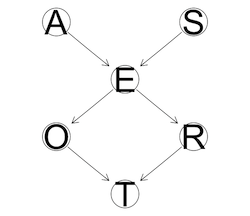

```{r setup, include=FALSE}
library(bnlearn)
library(Rgraphviz)
```

# CS7290 Causal Modeling in Machine Learning: Homework 1

Name: Harish Ramani
NUID: 001885194

## Background

Recall the survey data discussed in the lecture.

* **Age (A):** It is recorded as *young* (**young**) for individuals below 30 years, *adult* (**adult**) for individuals between 30 and 60 years old, and *old* (**old**) for people older than 60.
* **Sex (S):** The biological sex of individual, recorded as *male* (**M**) or *female* (**F**).
* **Education (E):** The highest level of education or training completed by the individual, recorded either *high school* (**high**) or *university degree* (**uni**).
* **Occupation (O):** It is recorded as an *employee* (**emp**) or a *self employed* (**self**) worker.
* **Residence (R):** The size of the city the individual lives in, recorded as *small* (**small**) or *big* (**big**).
* **Travel (T):** The means of transport favoured by the individual, recorded as *car* (**car**), *train* (**train**) or *other* (**other**)

Travel is the *target* of the survey, the quantity of interest whose behavior is under investigation.

We use the following directed acyclic graph (DAG) as our basis for building a model of the process that generated this data.



## 1 Building a DAG (4 points)

A DAG maps to a factorization of the joint distribution (e.g., $P(A, B, C) == P(A)P(B|A)P(C|B)$).  In *bnlearn*, you can use the function `modelstring(dag)` to convert a DAG into a string representation of a factorization of the joint probability distribution. We can go from a string representation to a DAG using the function `model2network(string)`.

(a) Write out the factorization of the joint distribution implied by the DAG using mathematical notation

$P(A,S,E,O,R,T) == P(A)P(S)P(E|A,S)P(O|E)P(R|E)P(T|O,R$

(b) Rewrite the above factorization in *bnlearn*'s string representation.

```{r}
"[A][S][E|A:S][O|E][R|E][T|O:R]"
```

(c) Use this to create a DAG in *bnlearn*.

```{r}
dag <- model2network("[A][S][E|A:S][O|E][R|E][T|O:R]")
```

(d) Print the class of the DAG object.

```{r}
class(dag)
```

(e) Use `graphviz.plot` to plot the DAG.

```{r}
graphviz.plot(dag)
```


## 2 Experimenting with graph utilities (6 points)

(a) Extract and print the nodes and arcs of the DAG you created in previous questions.

```{r}
# Arcs of the DAG
print("The arcs of the dag are :::")
arcs_dag <- arcs(dag)
print(arcs_dag)

# Nodes of the DAG
print("The nodes of the dag are :::")
nodes_dag <- nodes(dag)
print(nodes_dag)
```

(b) Extract and print the parents and the children of each node using `parents` and `children` functions.
```{r}
printParents <- function(node) {
  print(paste("For node ::",node, "the parent/(s) is/are", parents(dag,node)))
}

printChildren <- function(node) {
  print(paste("For node ::",node, "the children/(s) is/are", children(dag,node)))
}
lapply(nodes(dag), printParents)
lapply(nodes(dag), printChildren)
```


(c) Use the `mb` function to extract the Markov blanket of A, E, and T.

```{r}
# Markov blanket of A
mb(dag,"A")

# Markov blanket of E
mb(dag,"E")

# Markov blanket of T
mb(dag,"T")
```

(d) Describe, in terms of the joint probability distribution and NOT in terms of the DAG the definition of a Markov blanket.

Lets say we have K random variables in a dag. Node N belongs to the set K. If the markov blanket of Node N is defined as M, then N is conditonally independant of other variables in K given M

`I_P(N, K(MU{N})|M)`

(e) How do you identify the Markov blanket from the DAG?

We look at the parents of the node and the children of the node and any other parents of the children.


## 3 Conditional probability distribution (CPD) parameter estimation (4 points)

Bayesian network = DAG + CPD with specified parameters

(a) Fit the parameters of the DAG from the data stored in survey2.txt using Bayesian estimation, and save the result into an object of class bn.fit.

```{r}
data<- read.table("./survey2.txt", header=TRUE)
fit<- bn.fit(dag,data, method="bayes")
fit
```

(b) Play with the Bayesian prior parameter **iss** and report the changes in the parameters learned from Bayesian network. Explain the changes.

```{r}
fit.iss.low <- bn.fit(dag, data, method = "bayes", iss=2)
fit.iss.high <- bn.fit(dag, data, method = "bayes", iss=100000)
```

It plays a role in changing the prior weights and as a result we see a change in the conditional probability table values.


## 4 Graph manipulation (4 points)

(a) Create a copy of the DAG (e.g. `dag2 <- dag`).  Remove the arc from Education to Occupation, and plot the result with `graphviz.plot`.

```{r}
dag2<- drop.arc(dag,"E", "O")
graphviz.plot(dag2)
```

(b) Fit the parameters of the modified network. Which local distributions change, and how?

```{r}
fit2 <- bn.fit(dag2, data, method="bayes")
fit2
```


## 5 Markov equivalence (12 points)

(a) Compute and plot the PDAG of the DAG for the survey data using the `cpdag` function.  Call this PDAG P1 and the original DAG D1.  How does P1 and D1 compare?  Explain any similarities or differences.

```{r}
d1 <- dag
p1 <- cpdag(d1, moral=FALSE)
graphviz.plot(d1)
graphviz.plot(p1)
```

They are the same because there are no other DAG constructions such that their matrix factorizations are same.

(b) Create a DAG D2 that is the same as D1 except that it has a new arc from Occupation to Residence.  This makes sense because surely somebody's job determines where they live (or is it the other way around?).  Note that this is a fine example of applying domain knowledge about the data generative process in causal model development. Plot the result with `graphviz.plot`.

```{r}
d2 <- set.arc(d1, "O", "R")
graphviz.plot(d2)
```

(c) Now recompute a PDAG P2 from D2.  What, if anything, is different between P1 and P2 and what explains these differences or lack of differences?

```{r}
p2_immoral <- cpdag(d2, moral=FALSE)
p2_moral <- cpdag(d2)
graphviz.plot(p2_immoral)
graphviz.plot(p2_moral)
```
If V structures are defined by Koller (`moral=TRUE`)  then there is a class of DAGS(2, precisely). The edge between O and R is undirected. Mean O causes R and R causes O , both are in the class of dags. If V structures are defined by pearl (`moral=FALSE`)then there is no difference between the dag and the pdag. 


(d) Create a third DAG D3 that is different from the second DAG (with the O->R edge) but is in the same Markov equivalence class. Do this by reasoning about P2 -- in other words look at P2 and create another DAG D3, such that `cpdag(D3)` will also produce P2.  Plot D3.

```{r}
d3 <- set.arc(d1, "R", "O")
p3 <- cpdag(d3)
graphviz.plot(p3)
graphviz.plot(d3)
```

(e) Calculate the log-likelihood of the data given D2 and the log-likelihood of the data given D3.  These values should be the same, explain why.  You can use the `score` function with the argument `type = 'loglik`, or you can simply se the `logLik` function, which is just a wrapper for `score`.  You don't need to provide paramter values for the CPDs of the DAG, `score` will estimate them for you.

```{r}
logLik(d2,data)
logLik(d3, data)
```

Since d2 and d3  have the same pdag, it factorizes to the same probability distribution and hence we get the same log likelihood.

## 6 Switching to Pyro (18 points)

If you are new to tensor-based frameworks, make sure you give yourself plenty of time for this question.  It takes time to get used to debugging.  One common source of bugs is integers, *pyro* prefers you use floats (e.g., `torch.tensor(1.0)` instead of `torch.tensor(1)`).  If you hit a bug and solve it, why not share with your classmates on Piazza?

(a) Use *pyro* to reimplement the Bayesian network with parameter values you fitted in question 3.  Use default *iss* values and round parameter estimates to 2 decimal places.  Show source code.

Answer the following inference questions using `pyro.condition` and (if needed) a *pyro* inference algorithm. 

(b) You observe a person with a university degree. What is your prediction of this person's means of travel?Provide either a MAP estimate or a histogram of the marginal on the variable "T". 
    
(c) You observe a self-employed person who lives in a big city. What is your prediction of this person's age?  Provide either a MAP estimate or a histogram of the marginal on the variable "A".  

Hint: An exact inference algorithm such as variable elimination could work here, but it can become intractable on certain networks. One class of approximate inference methods uses random sampling to approximate the distribution. One sampling approach used to answer inference question given observation is rejection sampling. However, it can be wasteful because it rejects all the samples that do not match the observation. A more efficient sampling approach is importance sampling (http://docs.pyro.ai/en/stable/inference_algos.html#module-pyro.infer.importance). We encourage you to experiment with different inference methods in Pyro. Detailed understanding about how these methods work is not the focus or requirement of this course. This course only requires a high level understand of Bayisian inference methods and being able to use them in Pyro.