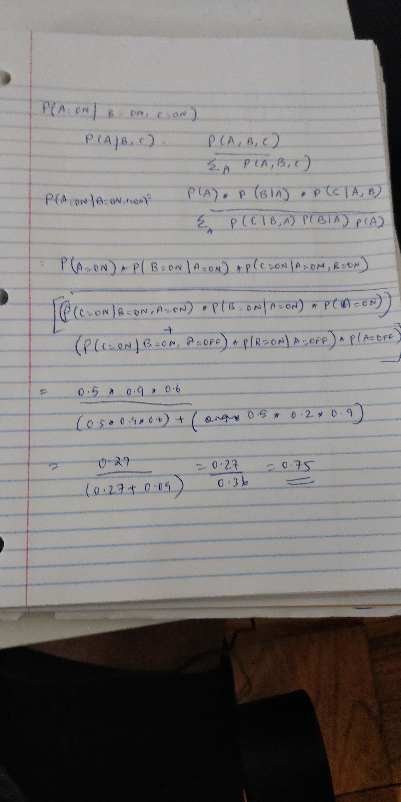

```{r setup, include=FALSE}
knitr::opts_chunk$set(echo = TRUE)
library(bnlearn)
library(dplyr)
```

# CS7290 Causal Modeling in Machine Learning: Homework 2

For this assignment, we will once again reason on a generative model using `bnlearn` and `pyro`. Check out the [*bnlearn* docs](http://www.bnlearn.com) and the [*pyro* docs](http://pyro.ai) if you have questions about these packages.

## Submission guidelines

Use a Jupyter notebook and/or R Markdown file to combine code and text answers.  Compile your solution to a static PDF document(s).  Submit both the compiled PDF and source files.  The TA's will recompile your solutions, and a failing grade will be assigned if the document fails to recompile due to bugs in the code.  If you use [Google Collab](https://colab.research.google.com/notebook), send the link as well as downloaded PDF and source files.


Recall the survey DAG discussed in the previous homework. Use **survey.txt** and the DAG structure to answer Question 1 and 2.

* **Age (A):** It is recorded as *young* (**young**) for individuals below 30 years, *adult* (**adult**) for individuals between 30 and 60 years old, and *old* (**old**) for people older than 60.
* **Sex (S):** The biological sex of individual, recorded as *male* (**M**) or *female* (**F**).
* **Education (E):** The highest level of education or training completed by the individual, recorded either *high school* (**high**) or *university degree* (**uni**).
* **Occupation (O):** It is recorded as an *employee* (**emp**) or a *self employed* (**self**) worker.
* **Residence (R):** The size of the city the individual lives in, recorded as *small* (**small**) or *big* (**big**).
* **Travel (T):** The means of transport favoured by the individual, recorded as *car* (**car**), *train* (**train**) or *other* (**other**)

We use the following directed acyclic graph (DAG) as our basis for building a model of the process that generated this data.


Build the DAG and name it `net`.

```{r, echo=FALSE, message=FALSE, warning=FALSE}
library(bnlearn)
.data <- read.delim('survey.txt', sep = " ")
net <- model2network("[A][S][E|A:S][O|E][R|E][T|O:R]")
```

First, run the following code block to create the `d_sep` function .

```{r}
# This is the same as the bnlearn's `dsep` function but 
# avoids some type checking which would throw errors in this homework.
d_sep <- bnlearn:::dseparation
```

The following code evaluates the d-separation statement "A is d-separated from E by R and T".  This statement is false.

```{r}
d_sep(bn = net, x = 'A', y = 'E', z = c('R', 'T'))
```

We are going to do a brute-force evaluation of every possible d-separation statement for this graph.

First, run the following code in R.

```{r}
vars <- nodes(net)
pairs <- combn(x = vars, 2, list)
arg_sets <- list()
for(pair in pairs){
  others <- setdiff(vars, pair)
  print(others)
  conditioning_sets <- unlist(lapply(0:4, function(.x) combn(others, .x, list)), recursive = F)
  for(set in conditioning_sets){
    args <- list(x = pair[1], y = pair[2], z = set)
    arg_sets <- c(arg_sets, list(args)) 
  }
}
```

The above code did a bit of combinatorics that calculates all the pairs to compare, i.e. the 'x' and 'y' arguments in `d_sep`.  For each pair, all subsets of size 0 - 4 variables that are not in that pair are calculated.  Each pair / other variable subset combination is an element in the `arg_sets` list.

For each pair of variables in the DAG, we want to evaluated if they are d-separated by the other nodes in the DAG.  The code above does a bit of combinatorics to grab all pairs of variables from that DAG, and then for each pair, calculates all subsets of size 0, 1, 2, 3, and 4 of other variables that are not in that pair.  For example, the arguments to the above statement `d_sep(bn = net, x = 'A', y = 'E', z = c('R', 'T'))` are the 10th element in that list:

```{r}
arg_sets[[10]]
```

You can evaluate the satement as follows:

```{r}
arg_set <- arg_sets[[10]]
d_sep(bn=net, x=arg_set$x, y=arg_set$y, z=arg_set$z)
```

## Question 1: D-separation and global Markov property assumption

### 1.a True d-separation statements (4 points)
Create a new list. Iterate through the list of argument sets and evaluate if the d-separation statement is true. If a statement is true, add it to the list.  Show code.  Print an element from the list and write out the d-separation statement in English. 


```{r}
addStatements <- function(stat) {
  if(d_sep(bn=net, x=stat$x, y=stat$y, z=stat$z)) {
    return(stat)
  }
}

all_true_stats <- lapply(arg_sets, addStatements)

# Statements that are not d-separated would be present as NONE in my list. We need to remove those elements.
all_true_stats<- all_true_stats[lengths(all_true_stats)!=0]

# Printing out the first element in the true d -separated statements.
all_true_stats[[1]]
```

The node "A" is d-separated from the node "0" given that the node "E" is observed. The path is active as the node "E" is the common effect.

### 1.b Redundant d-separation statements (3 points)

Given two d-separation statements A and B, if A implies B, then we can say B is a redundant statement. This list is going to have some redundant statements. Print out an example of two elements in the list, where one one element implies other element.  Write both of them out as d-separation statements, and explain the redundancy in plain English. 

```{r}
# Statement - 1
all_true_stats[[1]]

# Statement -2 
all_true_stats[[2]]
```
The first statement says that the node "A" is d-separated from node "O" given that the node "E" is observed. The second statement says that the node "A" is d-separated from node "0" given that the node "E" and node "R" is observed. Now, both the statements are equivalent since they are both d-separated statements. Also, the second statement is redundant because even if the node "R" isn't observed, the d-separation holds through the node "E"

### 1.c Improve the brute-force algorithm for finding true d-separation statements (1 point)

Based on this understanding of redundancy, how could this algorithm for finding true d-separation statements be made more efficient?

**Graphical Way**:

If a node X is d-separates node Y when observed on node Z, all the children of the the node X are d-separated from the node Y along its path. So, we don't need to observe any other nodes in the same path.


**Another way:**

Before adding it to args set, we can actually check if the statement is a d-separation or not. If its d-separated before adding it to a list , check the list for any other statement with the same from and to node. For every such statement, if the length of the intersection of observed nodes is less than its length and the length of the observed nodes is greater than 1, then remove the one with the greater length. 


### 1.d Conditional independence test on true d-separation statements (4 points)

A joint distribution ${P_{\mathbb{X}}}$ is said to satisfy **global Markov property** with respect to DAG ${\mathbb{G}}$ if $A \perp_{\mathbb{G}}B|C \Rightarrow  A \perp_{P_{\mathbb{X}} }B|C$ for all disjoint vertex sets A, B, C. In other words, every true d-separation statement in the DAG corresponds to a true conditional independence statement in the joint probability distribution.  We don't know the true underlying joint probability distribution that generated this data, but we do have the data.  That means we can do statistical tests for conditional independence, and use some quick and dirty statistical decision theory to decide whether a conditional independence statement is true or false.

The `ci.test` function in `bnlearn` does statistical tests for conditional independence.  The null hypothesis in this test is that the conditional independence is true.  So our decision critera is going to be:

> If p value is below a .05 significance threshold, conclude that the conditional independence statement is false  Otherwise conclude it is true.

```{r}
test_outcome <- ci.test('T', 'E', c('O', 'R'), .data)
print(test_outcome)
print(test_outcome$p.value)
alpha <- .05
print(test_outcome$p.value > alpha)
```

Evaluate the global Markov property assumption by doing a conditional independence test for each true d-separation statement. Print any test results where the p-value is not greater than .05.


```{r}
# Printing all statements where the ci test fails.
for(statement in all_true_stats){
  test_outcome<- ci.test(statement$x, statement$y, statement$z, .data)
  alpha <- .05
  if (test_outcome$p.value < alpha) {
    print("----------------------------------")
    print(statement)
    print("-----------------------------------")
  }
}
```


### 1.e Conditional independest test and non-redundant d-separation statements (1 point plus 2 points extra credit)

What is apparent about these these printed statements with respect to whether or not the statement is redundant?

**Answer:** All the statements that failed the conditional independance test are redundant d-separation statements.

Extra credit (ask a statistician): Why might this issue with redundant statements be happening?

My guess is that there may be some back door paths that are activated by observing additional nodes especially if the DAG doesn't capture the data generation process effectively. Since, the extra nodes aren't in the graph, the d-separation statements come out as true, but the data tells a different story via the conditional independant tests.

## Question 2: Faithfulness assumption

### 2.a True conditional independence statements (4 points)

A joint distribution $P_{\mathbb{X}}$ is **faithful** to DAG ${\mathbb{G}}$ if $A \perp_{P_{\mathbb{X}}}B|C \Rightarrow  A \perp_{\mathbb{G} }B|C$ for all disjoint vertex set A, B, C. In other words, every true conditional independence statement about the joint distribution corresponds to a true d-separation statement in the DAG  Iterate through the `arg_sets` list again, run the conditional independence test for each argument set, creating a new list of sets where you conclude the conditional independence statement is true.

```{r}
total<-0
true_d_sep <- 0
false_d_sep <- 0
true_cond_ind <-0
false_cond_ind <- 0
true_d_sep_true_cond <- 0
true_d_sep_false_cond <- 0
false_d_sep_true_cond <- 0
false_d_sep_false_cond <- 0
alpha <- .05
cond_sets = list()

for (statm in arg_sets) {
  test_outcome<- ci.test(statm$x, statm$y, statm$z, .data)
  if(d_sep(bn=net, x=statm$x, y=statm$y, z=statm$z)) {
    # True d_separation
    true_d_sep<-true_d_sep+1
    if (test_outcome$p.value > alpha) {
      # True cond indpendence
      true_cond_ind<-true_cond_ind+1
      true_d_sep_true_cond<-true_d_sep_true_cond+1
      cond_sets<- c(cond_sets, list(statm))
    } else {
      # False cond independance
      false_cond_ind<-false_cond_ind+1
      true_d_sep_false_cond<-true_d_sep_false_cond+1
    }
    
  } else {
    # False d_separation
    false_d_sep<-false_d_sep+1
    if (test_outcome$p.value > alpha) {
      # True cond indpendence
      true_cond_ind<-true_cond_ind+1
      false_d_sep_true_cond<- false_d_sep_true_cond+1
      cond_sets<- c(cond_sets, list(statm))
    } else {
      # False cond independance
      false_cond_ind<-false_cond_ind+1
      false_d_sep_false_cond<- false_d_sep_false_cond+1
    }
  }
  total<-total+1
}
```


### 2.b True conditional inpdendence statements among true d-separation statements (1 point)

Combine that analysis with the analysis from previous questions. What is the proportion of true D-separation statements that are also true conditional independence statements?

```{r}
(true_d_sep_true_cond/true_d_sep)*100
```
Around 92% of statements  are true d-separtion statements which are also conditionally true independant statements.

### 2.c True d-separation statements among true conditional inpdendence statements (1 point)

What is the proportion of true conditional independence statements that are also true-deseparation statements?

```{r}
(true_d_sep_true_cond/true_cond_ind) * 100
```
Around 34% of statements are true conditonally independant and d-separated statements among all conditonally independant statements.

### 2.d Results of non-redundant d-separation statements (1 point)

How would these results change if we only considered non-redundant d-separation statements?

The proportion would increase if only non-redundant d-separation statements were considered. (This doesn't change the faithfullness assumption much.)

### 2.e Conclusion (1 point)

Based on these results, how well do the faithfulness assumption and global Markov property assumption hold up with this DAG and dataset?

The faithfullness assumption doesn't hold well whereas the global markov property assumption holds up with this DAG.

## Question 3: Interventions as graph mutilation

Run the following code to build a simple three node graph.

```{r, canonical}
net <- model2network('[A][B|A][C|B:A]')
nombres <- c('off', 'on')
cptA <- matrix(c(0.5, 0.5), ncol=2)
dimnames(cptA) <- list(NULL, nombres)
cptB <- matrix(c(.8, .2, .1, .9), ncol=2)
dimnames(cptB) <- list(B = nombres, A = nombres)
cptC <- matrix(c(.9, .1, .99, .01, .1, .9, .4, .6))
dim(cptC) <- c(2, 2, 2)
dimnames(cptC) <-  list(C = nombres, A = nombres, B = nombres)
model <- custom.fit(net, list(A = cptA, B = cptB, C = cptC))
graphviz.plot(model)
```

The marginal probability of A is .5.

```{r}
model$A
```

### 3.a (3 points)

Given this model, use Baye's rule to calculate by hand $P(A = \text{on} \ | \ B = \text{on}, C = \text{on})$.  Show work. 
Hint:
\begin{align} 
P(A|B, C) &= \frac{P(A,B,C)}{\sum_A P(A, B, C)} \nonumber\\
&=\frac{P(C|B,A)P(B|A)P(A)}{\sum_AP(C|B,A)P(B|A)P(A)} \nonumber
\end{align} 

```{r}


```

### 3.b (3 points)

Estimate this probability using a *rejection sampling inference algorithm*.  To do this, use the `rbn` function in `bnlearn` (use `?rbn` to learn about it) to create a dataframe with a large number of sampled values from the model. Remove the rows where B and C are not both 'on'.  Estimate the $P(A = on\ | \  B = on, C = on)$ as the proportion of rows where A == 'on'.  (Pro tip: Try the `filter` function in the package `dplyr`).  

```{r}
rbn(model, n=10000) %>%
  filter(B=="on" & C=="on") %>%
  summarise(sum(A=="on")/n())
```

### 3.c (1 point)

Use `mutilated` to create a new graph under the intervention $\text{do}(B = on)$.  Plot the new graph.

```{r}
b_on_model <- mutilated(model, evidence = list(B="on"))
graphviz.plot(b_on_model)
```


### 3.d (3 points)

As in problem 3.1, use Baye's rule to calculate by hand $P(A = on\ | \  \text{do}(B = on), C = on)$.  Show work.

```{r}


```


### 3.e (2 points)

Use the rejection sampling inference procedure you used to estimate $P(A = on\ | \  B = on, C = on)$ to now estimate $P(A = on\ | \  \text{do}(B = on), C = on)$.  

```{r}
rbn(b_on_model, n=10000) %>%
  filter(B=="on" & C=="on") %>%
  summarise(sum(A=="on")/n())
```


### 4.h (6 points)

Implement this model in `pyro`.  Then calculate $P(A = on\ | \  B = on, C = on)$ and $P(A = on\ | \  \text{do}(B = on), C = on)$ use the `condition` and `do` operators and an inference algorthm.
